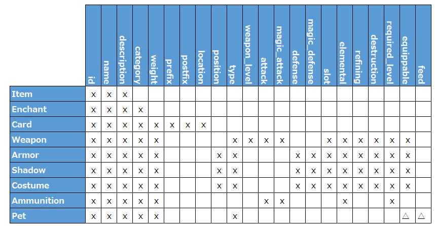

# ro-data-gen
Data generator for jRO (Japanese Ragnaok Online) fansite

## Requirement
* Python
  * 3.11.3 で動作確認
* パッチデータ
  * cardpostfixnametable.txt
  * cardprefixnametable.txt
  * idnum2itemdesctable.txt
  * idnum2itemdisplaynametable.txt
  * itemslotcounttable.txt

  ```data/``` に保存

## Usage
```
usage: gen.py [-h] [-d] [-v]

options:
  -h, --help     show this help message and exit
  -d, --debug
  -v, --verbose
```
dist/item.json に出力されます


## Feature
アイテムデータをJSON形式で出力します

次のようにザックリとした分類別けをして、category として設定しています

* アイテム　(↓に当てはまらないもの全般)
* エンチャント
* カード
* 武器
* 防具
* シャドウ
* 衣装
* 弾薬　(攻撃の消費アイテム? 矢・弾・投擲・砲弾)
* ペット系　(卵・テイミングアイテム・キューペット装備)

### カテゴリー別メンバ一覧
それぞれのキーが何を指すかは、出力されたjsonを眺めてみてください。

ｘ ... 持つ  
␣ ... 持たない  
△ ... ものによる ("feed"は卵、"equippable"はキューペット装備)

## Licence
[Apache License, Version 2.0](https://opensource.org/blog/license/apache-2-0)